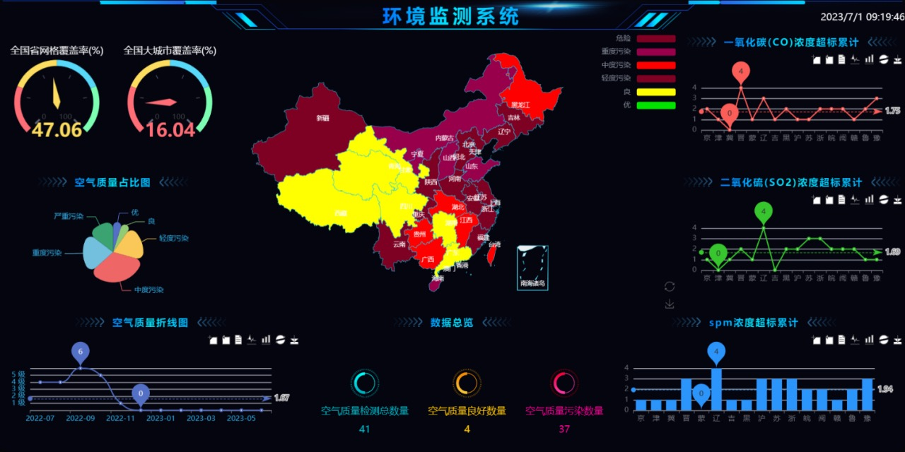

# 实践周第一组大屏端

## 效果展示


## 项目配置：
    vue3+echart+pinia
 - 环境变量配置
 - 接口配置
 - echart图表类封装
 - git 

## 地图配置：
1） 百度地图api
2) China.js
3) 数据转换:
    看用的哪个配置：百度地图需要将后端数据得到的省市名转换成经纬度。（城市的经纬度在`constant.js`提前定义）。
    用的是China.js的话直接将传`name`,`value`
    - 汉字字符串的匹配 '省｜市'
    3.1 正则表达式
    3.2 直接slice

## 各类图表的自定义

### 地图的图表
    `formatter`配置,
    `visualMap` 中的` type: "piecewise",` ,将`pieces` 配置成对应的数据映射(包括`value`,`color`)

### 气体图表的封装
  三个气体图表用的都是一个接口。可以封装成一个组件
  - `props`：
    ```
        const props = defineProps({
            att:String,
            label:String,
            color:String,
            type:{
                type:String,
                default:'line'
            }
        })
        const totalData = inject('totalGasData')
    ```
  - `toolBox`配置,有更多的操作